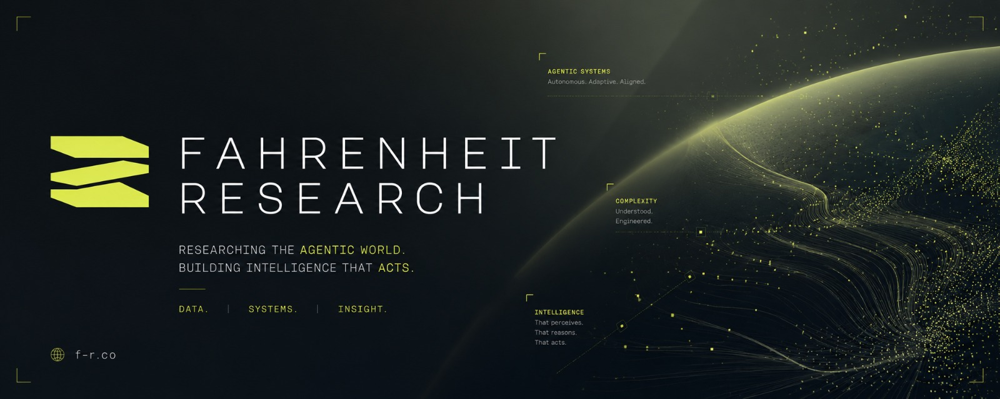

### Pioneering the future of **Agentic AI**

*Autonomous intelligence · Adaptive systems · Machine reasoning*

---

## 🔥 What we build

We build the **infrastructure layer for autonomous agents** — the memory, routing, transport, and orchestration primitives that let AI agents reason, remember, and act reliably over long horizons. Around that core we ship full agentic products: a terminal-native assistant, a lead-intelligence platform, and a capital-matching engine.

---

## 🧠 The Agent Stack

> Modular building blocks designed to power **Hermes Agent** — or any autonomous system.

| Project | What it does |
| :-- | :-- |
| **[AgentBrain](https://github.com/fahrenheit-research/AgentBrain)** 🧠 | Production-grade local memory layer — temporal knowledge graph, hierarchical memory tiers (working → episodic → semantic → archive), background synthesis, and Obsidian export. |
| **[AgentMomento](https://github.com/fahrenheit-research/AgentMomento)** 🎯 | Two-stage, category-first skill router. Classifies the task, then runs BM25 retrieval within the category — killing context pollution and boosting agent reliability. |
| **[AgentWire](https://github.com/fahrenheit-research/AgentWire)** 🔌 | Wire protocol for agents — efficient context encoding, compression, and envelopes for moving state between agents and runs. |

## 🚀 Products

| Project | What it does |
| :-- | :-- |
| **[Argus](https://github.com/fahrenheit-research/Argus)** 👁️ | A watchful, self-hosted AI agent that lives in your terminal — voice mode, Telegram gateway, HTTP/WebSocket API, cron scheduler, local vector memory, and a multi-agent swarm. |
| **Iris** 📈 *(private)* | Lead generation & enrichment platform — Next.js + FastAPI, Supabase, and Redis for intelligent prospecting. |
| **Ninth** 💸 *(private)* | AI capital-matching engine — extracts every signal from a pitch deck (text, charts, tables, image-locked numbers), scores it on a deterministic rubric, and matches founders to investors via vector similarity + structured filters. |

---

### Let's build the autonomous future together.

<!-- profile -->
